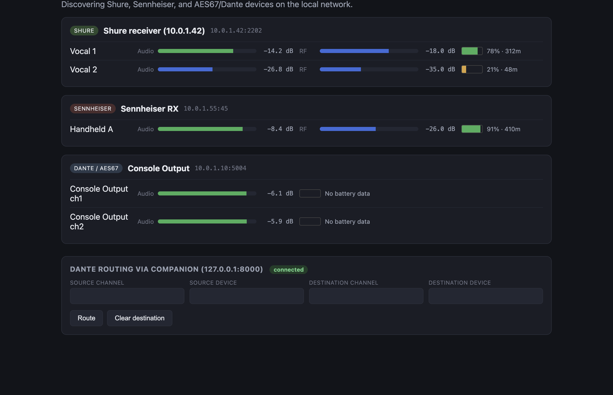

# Wireless Mic Monitor

> **AI-assisted project.** This codebase was created with [Claude Code](https://claude.com/claude-code)
> (Anthropic). Protocol adapters are built against a mix of publicly documented specs
> and best-effort reverse engineering - each adapter's module doc comment says which,
> and none of it has been validated against real hardware yet. See
> [Protocol status](#protocol-status) before relying on this for a live show.

An Electron app that discovers Shure and Sennheiser wireless mic receivers on the
local network, monitors their audio levels (via AES67) and battery/RF status, and
(planned) routes audio in from a USB soundcard for receivers that don't have
network audio at all. Optional Dante route triggering is available by pointing it
at your own Bitfocus Companion instance - see below.



*Mockup with simulated data - captured from the real running app's own renderer
(not a hand-drawn design), but no real hardware is on this network. See
[AI disclosure](#ai-disclosure) below.*

Same spirit as this author's other radio-mic tools -
[wsm-wwb-bridge](https://github.com/allansargeant/wsm-wwb-bridge) (frequency
coordination file exchange) and [Dante-BabelBox](https://github.com/allansargeant/Dante-BabelBox)
(cross-vendor Dante preamp control) - but for real-time monitoring instead of file
exchange or gain control.

## Status: early scaffold, not yet tested against real hardware

What's implemented and structurally complete:

- **Device registry** ([src/main/deviceRegistry.ts](src/main/deviceRegistry.ts)) - merges
  partial info from every discovery source into one device list, pushed to the renderer
  over IPC.
- **Dante/AES67 mDNS discovery** ([src/main/discovery/mdns.ts](src/main/discovery/mdns.ts)) -
  browses `_netaudio-arc._udp` / `_netaudio-chan._udp`, the same service types verified
  against real Dante gear in Dante-BabelBox.
- **AES67 audio monitoring** ([src/main/audio/sap.ts](src/main/audio/sap.ts),
  [src/main/audio/aes67.ts](src/main/audio/aes67.ts)) - listens for SAP stream
  announcements, joins the RTP multicast group, decodes L16/L24 PCM, computes
  per-channel RMS/peak levels.
- **Shure Command Strings adapter** ([src/main/discovery/shure.ts](src/main/discovery/shure.ts)) -
  subnet TCP scan on port 2202, ASCII command protocol, battery/RF/audio metering.
  Built from Shure's publicly documented per-product "Command Strings" PDFs.
- **Sennheiser SSC adapter** ([src/main/discovery/sennheiser.ts](src/main/discovery/sennheiser.ts)) -
  more speculative than Shure; see the file's doc comment.
- **USB input metering** ([src/renderer/src/audio/usbAudio.ts](src/renderer/src/audio/usbAudio.ts)) -
  Web Audio API capture + level metering, no native audio addon required.

What's blocked or not started:

- **Full Dante API integration** - blocked on Audinate's Dante Developer Program
  application (manual approval, NDA, license terms). See
  [src/main/audio/danteApi.ts](src/main/audio/danteApi.ts) for what this unlocks
  over AES67 and why nobody can just fetch the SDK on your behalf.
- **USB output routing** (sending audio back out to hardware, not just metering
  an input) - not designed yet.
- Real-hardware validation of every adapter above.

## Dante routing: this app has none, on purpose - it presses buttons in your Companion instead

This app never creates or changes Dante routes and contains no Dante
control-protocol code whatsoever, not even a stub. It only ever consumes
what's already routed: AES67 streams that exist on the network, or an audio
input device that's already receiving signal (which includes Dante Virtual
Soundcard / Dante Via inputs once you've routed into them yourself in Dante
Controller).

If you want a "press a button in this app and a Dante route happens"
experience, point it at your own [Bitfocus Companion](https://bitfocus.io/companion)
instance instead. Companion already has modules for this
([Dante Controller](https://github.com/bitfocus/companion-module-audinate-dantecontroller),
[Dante Domain Manager](https://github.com/bitfocus/companion-module-audinate-dante-ddm)) -
that's an actively maintained piece of software built for exactly this job,
whereas anything this app shipped itself would be a bespoke, unmaintained
one-off. Real Dante routing control requires either Audinate's licensed API
or an unofficial reverse-engineered client, and Dante itself is patented
technology - that's a call about what to run and trust that belongs in your
own Companion setup, not baked into this app.

How it works: this app is a plain HTTP client against
[Companion's documented remote-control API](https://companion.free/user-guide/v4.1/remote-control/http-remote-control/) -
setting custom variables and `POST`-ing `/api/location/:page/:row/:column/press`,
nothing Dante-specific about either. One button covers *every* route: Companion's
[Dante Controller module](https://github.com/bitfocus/companion-module-audinate-dantecontroller)
has a "Make Crosspoint" action whose four option fields
(`Source Channel Name`, `Source Device Name`, `Destination Channel`,
`Destination Device`) are all declared `useVariables: true` in its own source -
Companion resolves `$(custom:...)` in them at press-time. So instead of one
button per route, this app sets four custom variables then presses one button.

Setup:

1. In Companion, add the Dante Controller connection and configure it for your
   network as normal.
2. Create one button anywhere and add its **Make Crosspoint** action (the
   plain version, not the "drop down menu" variant - that one's fields are
   fixed dropdowns and won't take variables). Set each field to:
   - Source Channel Name: `$(custom:dante_src_channel)`
   - Source Device Name: `$(custom:dante_src_device)`
   - Destination Channel: `$(custom:dante_dst_channel)`
   - Destination Device: `$(custom:dante_dst_device)`
3. Optionally, create a second button with **Clear Crosspoint**, whose two
   fields (Destination Channel, Destination Device) get the same
   `$(custom:dante_dst_channel)` / `$(custom:dante_dst_device)` treatment.
4. Copy [companion-routes.example.json](companion-routes.example.json) to
   `companion-routes.json` in this app's user data folder (macOS:
   `~/Library/Application Support/wireless-mic-monitor/`). Fill in your
   Companion host/port and the page/row/column of the button(s) from steps
   2-3. `variablePrefix` must match what you used above (`dante` by default -
   change it in both places together if you want something else).
5. The renderer's routing panel becomes a free-form source/destination form -
   type (or pick from what this app has already discovered) a source
   channel+device and a destination channel+device, hit Route. No per-route
   setup, ever, on either side.

Absence of `companion-routes.json` is the default, expected state - the
routing panel just explains this instead of doing anything.

## Running it

```
npm install
npm run dev
```

This starts the Electron app with the discovery/monitoring pipeline running. On
first launch you'll see "No devices found yet" until something on your LAN
responds - AES67 devices need AES67 mode enabled in Dante Controller (it's off by
default), and Shure receivers need to be on the same /24 subnet as your machine
(see the discovery scan's limitation note in `shure.ts`).

## Protocol status

| Vendor / transport | Discovery | Metering | Confidence |
|---|---|---|---|
| Dante/AES67 (any vendor) | mDNS, verified in Dante-BabelBox | AES67 RTP multicast, SAP-announced | Discovery verified; audio decode logic untested against a real AES67 sender |
| Shure (ULX-D/QLX-D/Axient Digital) | TCP subnet scan, port 2202 | Command Strings protocol (Shure-published PDFs) | Protocol is documented; **not tested against real receivers** |
| Sennheiser (EW-DX/Digital 6000/9000) | mDNS `_ssc._tcp` | SSC (JSON over TCP) | Speculative - exact metering paths are best-effort guesses, needs a packet capture against real hardware to correct |
| Full Dante API | - | - | Blocked on Audinate Developer Program approval, see above |

If you have real Shure or Sennheiser hardware, or a Dante network with AES67
enabled: see [docs/data-captures.md](docs/data-captures.md) for exactly what
packet capture would help, and how to take one - it's simpler than it sounds,
no special network gear or bridging required.

## AI disclosure

Claude wrote the majority of this codebase - discovery adapters, the AES67
decoder, IPC plumbing, and the renderer UI - working interactively with the repo
owner, who directed scope and reviewed the output. The protocol adapters mix
publicly documented specs (Shure Command Strings, Dante's mDNS service types) with
best-effort reconstruction from public examples (Sennheiser SSC); treat this as
AI-assisted rather than independently audited, especially before use on live gear.
